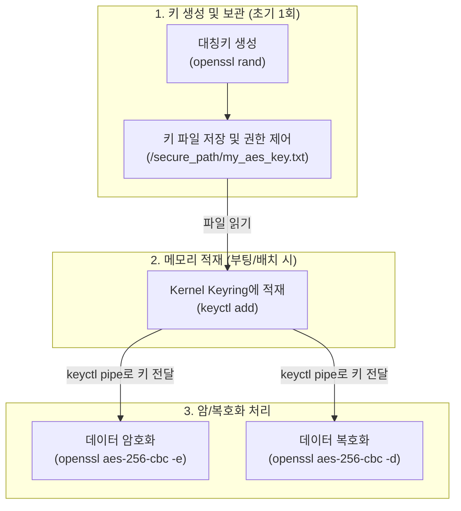

# 개인정보 및 과금 CDR 암호화 가이드

## 문서 정보
* **문서 버전**: v1.1
* **최종 개정일**: 2026-06-29

## 변경 이력
| 버전 | 개정 일자 | 주요 개정 내용 | 작성자 |
| :---: | :---: | :--- | :---: |
| **v1.0** | 2026-06-26 | 초안 작성 | 이승학 |
| **v1.1** | 2026-06-29 | KMS 단독 사용 불가 및 대칭키 권고 사항 반영 | 이승학 |

## 1. 목적 및 범위
본 가이드는 서버 내에 보관되는 **개인정보**와 **과금 CDR(Call Detail Record)** 데이터의 유출을 방지하기 위하여, 데이터베이스(DB) 및 파일(로그) 암호화에 대한 보안 정책, 대상, 적용 방법 및 키 관리 기준을 정의합니다.

## 2. 주요 용어 정의
* **개인정보**: 개인신용정보를 포함하는 정보를 의미합니다. [출처: `개인정보 암호화 매뉴얼 개정(25.07.07개정) (1).pdf` - 1.3 용어정의]
* **위치정보**: 이동성이 있는 물건 또는 개인이 특정한 시간에 존재하거나 장소에 관한 정보로서 전기통신설비를 이용하여 측위된 것을 의미합니다. [출처: `개인정보 암호화 매뉴얼 개정(25.07.07개정) (1).pdf` - 1.3 용어정의]
* **양방향 암호화**: 파일 형태로 보관/처리되어 추후 내용 확인이 필수적인 데이터를 보호하기 위해 사용하는 방식입니다. 정해진 복호키로 복호화가 가능하며 대칭키 및 비대칭키 방식으로 나뉩니다.

## 3. 암호화 대상 및 정책
(※ 본 가이드라인이 다루는 데이터는 사후 조회 및 처리를 위해 복호화가 필수적이므로, 복호화가 불가능한 일방향 암호화 방식은 제외하고 양방향 암호화만을 가이드합니다.)

### 3.1 암호화 대상 정보
*   **개인 식별 및 주요 개인정보**: 고유식별정보(주민등록번호, 여권번호, 운전면허번호, 외국인등록번호, 국내거소신고번호), 금융정보(계좌번호, 신용카드번호), 위치정보, 주요 개인정보(이름, 생년월일, 성별, 휴대전화번호) 및 생체인식정보는 필수 암호화 대상입니다. [출처: `개인정보 암호화 매뉴얼 개정(25.07.07개정) (1).pdf` - 2.1 저장 시 암호화 [표1]]
*   **부분 암호화 허용 기준**: 주민등록번호 앞 7자리 이내, 신용카드번호 앞 6자리 이내는 평문 저장이 가능하며 나머지는 암호화하여 저장할 수 있습니다. [출처: `개인정보 암호화 매뉴얼 개정(25.07.07개정) (1).pdf` - 4.2.1 암호 프로그램 선정]
*   **주요 개인정보의 암호화 예외 (DB 성능 저하 등)**: 휴대전화번호, 이름, 생년월일 등의 '주요 개인정보'를 DB의 인덱스나 검색 키(Key)로 사용하여 암호화 시 고객 서비스 제공이 불가능하거나 성능이 현저하게 저하되는 경우, **해당 개인정보에 한해서만 예외적으로 암호화하지 않고 평문 저장**이 가능합니다. (단, 고유식별정보 및 금융정보는 예외 적용 불가) [출처: `개인정보 암호화 매뉴얼 개정(25.07.07개정) (1).pdf` - 2.1 저장 시 암호화]
*   **과금 CDR (Call Detail Record)**: 사용자의 통화 내역, 발수신 번호, 통화 시간, 식별자 등 (※ 당사 개인정보 처리 기준에 따라 주요 정보로 취급하여 양방향 암호화 적용)

### 3.2 암호화 알고리즘 정책
*   **대칭키 암호화 알고리즘**: 보안강도 128비트 이상의 안전한 대칭키 암호화 알고리즘 (`AES-128`, `AES-192`, `AES-256`, `SEED`, `ARIA-128` 등)을 사용하며, 블록 암호화 운영 방식은 `CBC` 모드 적용을 원칙으로 합니다. [출처: `개인정보 암호화 매뉴얼 개정(25.07.07개정) (1).pdf` - 4.2.3 암호화 알고리즘 선정 [표4]]
*   **비대칭키 암호화 알고리즘**: 공개키/개인키 기반의 `RSA` 등의 알고리즘을 사용하며, 데이터 수집/생산 주체와 분석/소비 주체가 분리되어 있을 때 키 관리의 안전성을 높이기 위해 활용됩니다.

## 4. 데이터베이스(DB) 암호화 방법
신규 서비스 및 암호화 적용 이력이 없는 시스템은 당사 표준 DB 암호화 솔루션인 **SafeDB (v3.2 이상)** 적용이 필수입니다. 단, 사내망 연동 불가, 모바일/PC 환경, 미지원 개발 언어 등 SafeDB 적용이 불가능한 예외 환경의 경우에 한해 표준 알고리즘을 준수한 자체 암호화를 적용할 수 있습니다. [출처: `InformationTech-(260610) 개인정보 암호화 투자심의 가이드-120626-055128.pdf` - 1. 암호화 관련 투자 심의 시 기준]

### 4.1 암호화 적용 방식 및 동작 구조
*   **API 방식 (Application-Level)**: 어플리케이션 소스코드에서 SafeDB SDK를 호출하여 암복호화.
*   **Plug-in 방식 (DB-Level)**: DBMS 서버에 플러그인 설치하여 어플리케이션 수정 없이 암복호화.
*   **SafeDB 동작 흐름**: WAS(어플리케이션) 또는 SafeDB Agent 기동 시, SafeDB 정책서버(Policy Server)와 연동하여 최신 암호화 정책 및 암호키를 수신받고 메모리에 로드(Load)한 뒤 DB 데이터 암/복호화에 사용합니다. [출처: `KT 암호화모듈(INISAFENET, SAFEDB) 통합 가이드_v1.5.pdf` - 3. SAFEDB 개요]

### 4.2 SafeDB 키 파일 관리 및 비상(Emergency) 모드
*   **키 파일 로컬 백업**: 정책서버에서 수신한 암호키는 Agent 기동 시 메모리에 로드됨과 동시에 파일 형태로 서버 내 지정된 경로(예: `...\Agent1\config\component\safedb_policy.xml`)에 백업 저장됩니다. 해당 파일 경로에는 WAS 또는 업무 계정의 쓰기(Write) 권한이 있어야 정상적으로 저장/업데이트됩니다. [출처: `KT 암호화모듈(INISAFENET, SAFEDB) 통합 가이드_v1.5.pdf` - 3. SAFEDB 개요]
*   **비상(Emergency) 모드**: 네트워크 통신 지연이나 정책서버 장애 등으로 정책서버와 연동이 불가할 경우, SafeDB Agent는 자동으로 오프라인(Emergency) 모드로 전환합니다. 이때 서버에 백업(기저장)된 로컬 키 파일(`safedb_policy.xml`)을 참조하여 암복호화를 수행함으로써 서비스 중단 없이 가용성을 보장합니다. [출처: `KT 암호화모듈(INISAFENET, SAFEDB) 통합 가이드_v1.5.pdf` - 3. SAFEDB 개요]
*   **장애 조치(Troubleshooting) 유의사항**: 암호화 모듈 관련 예외(`java.lang.NullPointerException` 또는 `BadPaddingException`)는 주로 WAS 재기동 과정에서 키 파일이 누락되었거나 복호화에 필요한 키가 동기화되지 않았을 때 발생합니다. 따라서 로컬 키 파일의 정상 유무를 점검하는 것이 중요합니다. [출처: `KT 암호화모듈(INISAFENET, SAFEDB) 통합 가이드_v1.5.pdf` - 4. 오류 조치 및 관제 설정 가이드]

### 4.3 SafeDB Agent 환경 설정 및 운영 관리
*   **환경 설정 파일**: SafeDB Agent 기동을 위해 주로 다음 두 설정 파일을 관리합니다. [출처: `[SafeDB] DB암호화_SafeDB_v3.2_Agent_설치및운영매뉴얼_v1.3.pdf` - 3.2 Agent 환경설정]
    *   `framework.properties`: Agent가 설치된 서버의 IP 및 기동/종료 시 사용할 포트 정보를 설정합니다.
    *   `component-safedb_agent.xml`: 정책서버(Policy Server) IP 및 연결 포트, 비상(Emergency) 모드 설정 등을 구성합니다.
*   **개인 키 비밀번호 저장**: Agent 기동 전 `masterConsole.bat` 또는 `masterConsole.sh` 스크립트를 실행하여 개인 키 패스워드를 안전하게 저장(`mpwd` 파일 생성)해야 정상적인 기동이 가능합니다. [출처: `[SafeDB] DB암호화_SafeDB_v3.2_Agent_설치및운영매뉴얼_v1.3.pdf` - 4.1 개인 키 비밀번호 저장]
*   **기동 시 포트 충돌(BindException) 주의**: Agent 기동 시 `java.net.BindException` (Address already in use) 오류가 발생할 경우, 이미 프로세스가 동작 중인지 확인하거나 `framework.properties`의 `framework.shutdown.port` 설정 충돌 여부를 점검해야 합니다. [출처: `[SafeDB] DB암호화_SafeDB_v3.2_Agent_설치및운영매뉴얼_v1.3.pdf` - 5.1 기동 시 오류]

### 4.4 SafeDB API 방식 적용 예시 (JAVA SDK)
```java
// [출처: [SafeDB] DB암호화_SafeDB_v3.2_SDK_적용가이드_v1.11.pdf - 4.4.3 기본 Sample]
import com.initech.safedb.SimpleSafeDB;

// 1. 초기화 및 로그인
SimpleSafeDB safedb = SimpleSafeDB.getInstance();
safedb.login(); 

String userName = "SAFEDB_USER";
String tableName = "CDR_TABLE";
String columnName = "CALLER_NUMBER"; // 정책에 정의된 컬럼명
byte[] plainData = "01012345678".getBytes();

// 2. 암호화 (Encrypt)
byte[] encryptedData = safedb.encrypt(userName, tableName, columnName, plainData);

// 3. 복호화 (Decrypt)
byte[] decryptedData = safedb.decrypt(userName, tableName, columnName, encryptedData);
```

## 5. 파일 및 로그 암호화 방법
### 5.1 로그/파일 저장 정책
*   원칙적으로 개인정보 및 주요 데이터는 파일 형태가 아닌 DB 저장을 권고합니다. [출처: `InformationTech-(260610) 개인정보 암호화 투자심의 가이드-120626-055128.pdf` - 2. 저장 암호화 진행 시 공통 공수 분석]
*   암호화 되지 않은 개인식별정보, 금융정보, 생체인식정보 등을 서버에 파일형태로 저장하지 않도록 합니다. 
*   장애 원인 분석이나 과금 CDR 처리 등으로 불가피하게 파일로 저장해야 할 경우에는 자체 암호화(OpenSSL 등), 회사의 서버 DRM, 또는 안전한 양방향 암호화 알고리즘으로 암호화 처리하여 저장하고, 목적이 달성되는 즉시 파기합니다. [출처: `개인정보 암호화 매뉴얼 개정(25.07.07개정) (1).pdf` - 6.2 서버의 파일 암호화, `InformationTech-(260610) 개인정보 암호화 투자심의 가이드-120626-055128.pdf` - 2. 저장 암호화 진행 시 공통 공수 분석]

### 5.2 과금 CDR 파일 암호화 정책 (CTF / CDF 방식)
과금 CDR을 파일로 남길 경우, 시스템 구조에 따라 CTF 방식과 CDF 방식으로 나뉘며 두 방식 모두 암호화 대상입니다. (주로 새벽 시간대 `cron`을 이용한 일괄 암호화를 권장합니다.)
*   **CTF 방식**: 과금 데이터를 OFCS로 전송하고 과금 이력을 서버 로컬에 파일로 남기는 방식입니다. 생성된 이력 파일은 스케줄링을 통해 주기적으로 암호화합니다.
*   **CDF 방식**: 과금 데이터를 서버에 파일로 쌓아두면, MZN 서버에서 FTP(GET) 방식을 이용하여 파일을 가져가는 구조입니다.
    *   MZN 서버가 파일을 수집해간 이력을 해당 시스템에서 직접 알 수 없으므로, **사전에 담당 부서로 FTP 수집 시간(주기)을 문의하여 파악**해야 합니다.
    *   해당 **FTP 수집 시간이 지난 이후**에 데이터를 암호화하여 별도 폴더에 안전하게 백업 및 보관하도록 `cron` 스크립트 등을 구성해야 합니다.

### 5.3 파일 암호화 가이드 (대칭키 및 비대칭키)
파일 형태의 데이터를 암호화할 때는 복호화가 필수적이므로 **양방향 암호화(대칭키 또는 비대칭키)** 방식을 사용해야 합니다.
> **[권장 사항]**: 전사키 관리시스템(KMS) 담당자 권고에 따라, 비대칭키 방식보다는 **키 관리에 용이한 대칭키 암호화 방식을 활용할 것을 권장**합니다. (단, 보안상 키 분리가 엄격히 요구되는 특수 환경에서는 비대칭키 방식을 고려할 수 있습니다.)

#### 5.3.1 대칭키 암호화 (OpenSSL & Kernel Keyring 활용)
대칭키 방식은 암호화와 복호화에 동일한 키를 사용하는 방식입니다. 암호키가 파일시스템에 평문으로 노출되는 것을 방지하기 위해 **Linux Kernel Keyring** 방식을 활용하여 안전하게 키를 관리하고 OpenSSL과 연동합니다.

*   **Kernel Keyring 개념**: 암호키 등의 민감한 데이터를 디스크(파일)가 아닌 Linux 커널의 메모리 공간(Keyring)에 안전하게 캐싱하여 프로세스 간 공유 및 접근 제어를 수행하는 커널 수준의 보안 메커니즘입니다.
*   **⚠️ [보안 주의사항 (키 파일 접근 제어)]**: 어플리케이션(OpenSSL)이 직접 키 파일을 읽지 않고 커널 메모리를 통해 읽게 함으로써 노출 표면을 줄이는 효과는 있으나, **결국 적재를 위해 키가 디스크 어딘가에 평문으로 파일 형태로 존재해야 한다는 구조적 특징**이 있습니다. 따라서 암호키가 저장된 원본 파일에 대해서는 **반드시 관리자(소유자)만 접근할 수 있도록 OS 수준의 철저한 파일 접근 통제(예: chmod 400)가 필수적으로 동반**되어야 합니다.
*   **설치 및 설정**:
    *   대부분의 최신 Linux 배포판(RHEL/CentOS 6, 7 포함)에는 기본적으로 `keyutils` 패키지가 포함되어 있습니다.
    *   설치 확인 및 설치: `sudo yum install keyutils`

**[대칭키 암호화/복호화 흐름도]**


*   **사용 예제 (키 생성 및 암복호화 적용)**:
    1.  **안전한 암호키 생성 및 파일 저장 (초기 1회)**:
        ```bash
        # 1) 32바이트(256비트) 랜덤 키를 생성하여 안전한 디렉토리에 저장 (관리자만 접근 가능한 경로)
        $ openssl rand -hex 32 > /secure_path/my_aes_key.txt
        
        # 2) 파일 권한 제한 (소유자만 읽기 가능하도록 설정)
        $ chmod 400 /secure_path/my_aes_key.txt
        ```
    2.  **부팅 또는 배치 수행 시 Keyring에 키 적재 (메모리에 로드)**:
        ```bash
        # 파일에서 키를 읽어와 사용자 세션 키링에 'my_enc_key'라는 이름으로 등록
        # (주의: 평문 키가 파일시스템에 존재하므로, 해당 파일에 대한 접근 통제를 철저히 해야 합니다.)
        $ keyctl add user my_enc_key "$(cat /secure_path/my_aes_key.txt)" @s
        
        # 등록된 키 확인 (키 ID 및 등록 여부 확인)
        $ keyctl show
        ```
    3.  **Keyring에서 키를 읽어 OpenSSL 암호화 (AES-256-CBC)**:
        ```bash
        # keyctl pipe 명령으로 메모리에서 키를 읽어와서 파이프라인으로 openssl에 안전하게 전달
        $ keyctl pipe $(keyctl search @s user my_enc_key) | openssl aes-256-cbc -pass stdin -pbkdf2 -in plain_cdr.log -out encrypted_cdr.log.enc
        ```
    4.  **Keyring에서 키를 읽어 OpenSSL 복호화**:
        ```bash
        $ keyctl pipe $(keyctl search @s user my_enc_key) | openssl aes-256-cbc -d -pass stdin -pbkdf2 -in encrypted_cdr.log.enc -out decrypted_cdr.log
        ```

#### 5.3.2 비대칭키 암호화 (GPG 활용)
비대칭키 방식은 암호화에 사용하는 공개키(Public Key)와 복호화에 사용하는 개인키(Private Key)가 분리된 방식입니다. 데이터 생산자(공개키로 암호화)와 데이터 분석자(개인키로 복호화)가 다를 때 키 유출 위험을 원천 차단할 수 있어 파일 기반 연동에 매우 유용합니다.

*   **GPG (GnuPG) 개념**: 비대칭키(RSA 등)를 생성하여 파일을 안전하게 암호화하고 전자서명을 추가할 수 있는 강력한 오픈소스 암호화 도구입니다.
*   **보안 원칙 (키 분리)**: 복호화 키(개인키)를 암호화 키(공개키)와 같은 서버에 두지 않는 것을 원칙으로 합니다. (데이터 암호화 서버와 복호화 서버의 물리적/논리적 분리)
    *   **⚠️ [장애 조치 시 절대 주의]**: 이슈 분석을 위해 복호화가 필요할 때, **절대 복호화 키(개인키)를 암호화 서버로 업로드하여 복호화하면 안 됩니다.** 키를 서버에 임시로 올리는 순간 '데이터와 키의 동시 탈취'라는 치명적 보안 홀이 발생하며, 디스크 복구나 history 로그를 통한 2차 유출 위험이 큽니다.
    *   **올바른 조치 절차**: 복호화 키를 이동시키는 대신, **암호화된 데이터 파일(`*.gpg`)을 복호화 키가 안전하게 보관된 PC나 분석 서버로 다운로드(반출)하여 복호화**해야 합니다. (키는 데이터가 있는 곳으로 이동 불가, 데이터가 키가 있는 곳으로 이동)
*   **OS 지원 여부**: GPG는 RHEL/CentOS/Oracle Linux 6, 7 버전을 포함한 거의 모든 Linux 배포판에서 기본적으로 완벽하게 지원되며 안정적으로 동작합니다. (`gnupg` 또는 `gnupg2` 패키지)
*   **사용 예제 (서버 간 키 분리 원칙을 적용한 암복호화 흐름)**:
    *실제 운영 환경을 가정하여, 복호화 서버(B)에서 키를 생성하고 암호화 서버(A)로 공개키만 전달하는 시나리오입니다.*

    1.  **[복호화 서버] GPG 키 쌍 생성 및 공개키 추출**:
        ```bash
        # 1) 키 쌍(공개키/개인키) 생성 대화형 프롬프트 진행 (RSA 선택, 키 길이 2048 이상 권장)
        $ gpg --gen-key
        
        # 2) 생성된 공개키를 파일로 추출 (예: 사용자 ID가 'cdr_user'인 경우)
        $ gpg --armor --export cdr_user > cdr_public_key.asc
        
        # 3) 추출한 'cdr_public_key.asc' 파일을 암호화 대상 서버로 전송 (SFTP 등 이용)
        ```
    2.  **[암호화 서버] 공개키 가져오기(Import) 및 파일 암호화**:
        ```bash
        # 1) 복호화 서버로부터 받은 공개키를 GPG에 등록
        $ gpg --import cdr_public_key.asc
        
        # 2) 등록된 키의 신뢰도(Trust) 설정 (프롬프트에서 '5' (Ultimate trust) 선택 후 'y' 입력)
        $ gpg --edit-key cdr_user trust
        
        # 3) 'cdr_user'의 공개키를 이용하여 로그 파일 암호화
        # 암호화된 파일은 'plain_cdr.log.gpg'로 생성되며 원본 평문 파일은 그대로 유지됨
        $ gpg --recipient "cdr_user" --encrypt plain_cdr.log
        
        # 4) 완성된 암호화 파일('plain_cdr.log.gpg')을 복호화 서버로 전송
        ```
    3.  **[복호화 서버] 전송받은 파일 복호화 (개인키 활용)**:
        ```bash
        # 암호화 서버로부터 넘겨받은 파일을 개인키를 이용하여 복호화
        # (최초 복호화 시 키 생성 때 설정한 Passphrase 입력 필요. 배치 스크립트 적용 시 자동화 설정 필요)
        $ gpg --decrypt plain_cdr.log.gpg > decrypted_cdr.log
        ```

## 6. 암호키 관리 절차
암호키가 공격자에게 노출되면 암호문을 쉽게 복호화할 수 있으므로 전체 Life-Cycle에서 안전한 관리 절차를 준수해야 합니다. [출처: `개인정보 암호화 매뉴얼 개정(25.07.07개정) (1).pdf` - 7.1 암호키 관리 절차]

> **[참고] 전사키 관리시스템(KMS) 연동 및 사용 기준**
> 원칙적으로 '개인정보 암호화 매뉴얼'에서는 전사 통합 암호키 관리서버(KMS)를 이용한 생성 및 보관을 가이드하고 있습니다.
> 전사키 관리시스템(KMS) 담당자(개인정보기술팀 김정근 님, 서민아 님)에게 문의한 결과, **KMS는 단독으로 사용할 수 없으며 WAS 상에서 SAFEDB, INISAFENET SDK를 통해서 연동하여 사용해야 합니다.**
> 또한 담당자로부터 비대칭키보다는 **키 관리에 용이한 대칭키를 활용하라는 권고사항**이 있었습니다.
> 따라서 본 문서에서는 파일/로그 암호화 등 KMS 단독 연동이 불가한 영역에 대해 자체적으로 대칭키 등을 생성하고 안전하게 관리하는 방안을 기준으로 작성하였습니다.

*   **생성 및 이용**: 별도의 전사키 관리시스템(KMS) 없이 본 가이드의 방식(OpenSSL, GPG 등)에 따라 자체적으로 키를 생성하여 사용하며, 권한 있는 자만이 이용할 수 있도록 접근통제를 최소화해야 합니다.
*   **보관 규칙**: 생성된 암호키는 서버 내 안전한 경로에 파일 등 자체적인 방식으로 보관 및 백업을 관리하며, 특히 **프로그램 소스코드 내에 저장(하드코딩) 및 이동식 저장매체에 저장을 철저히 금지**합니다. (단, GPG 사용 시 복호화 키는 암호화 키와 동일한 서버에 보관 금지)
*   **갱신 및 파기**: 유효기간(전송구간 암호키 기준 2년 등)이 만료된 암호키는 사용이 불가하며, 안전하게 복구 불가능한 방법으로 즉시 파기해야 합니다.
